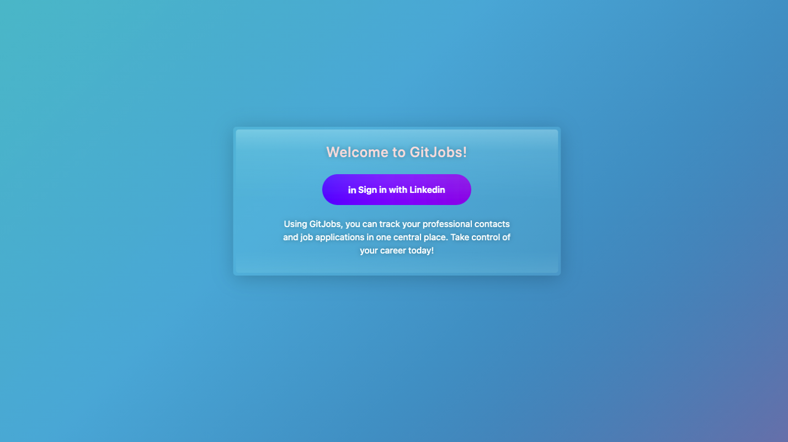
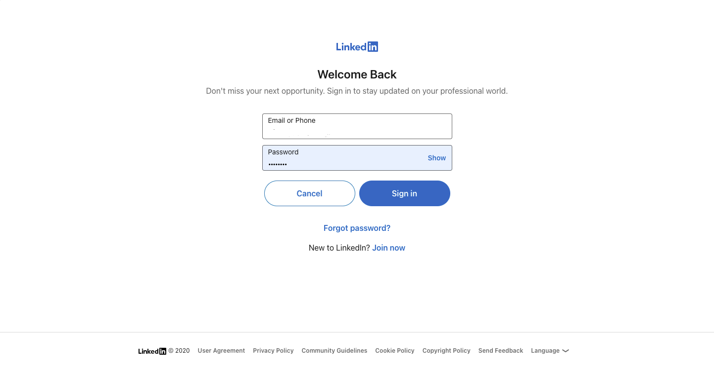
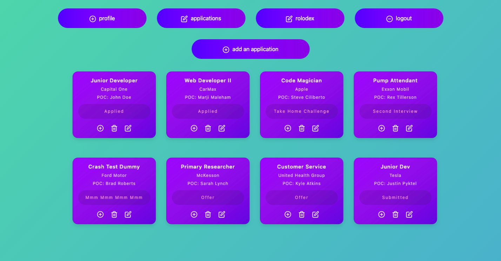
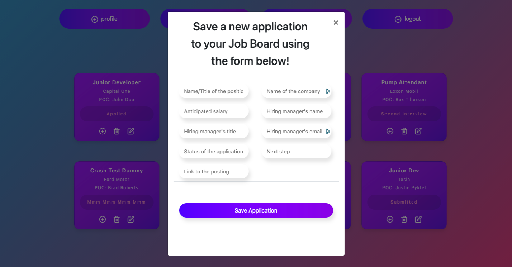
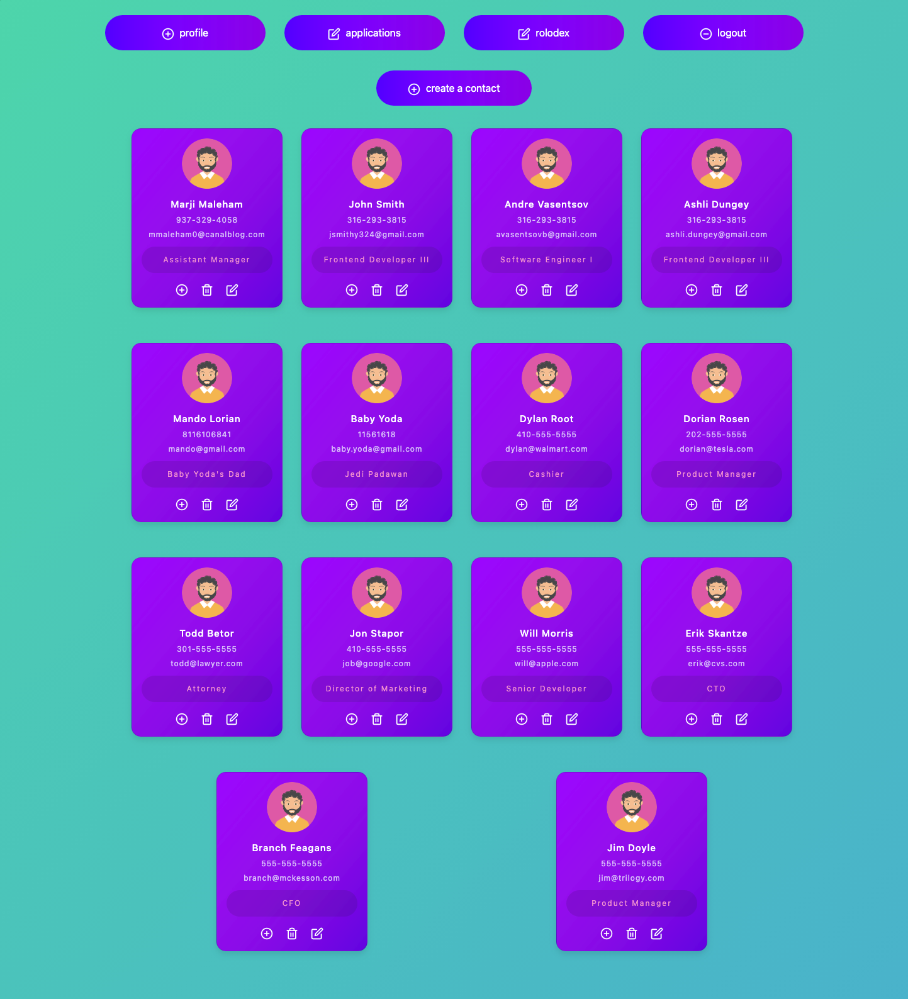
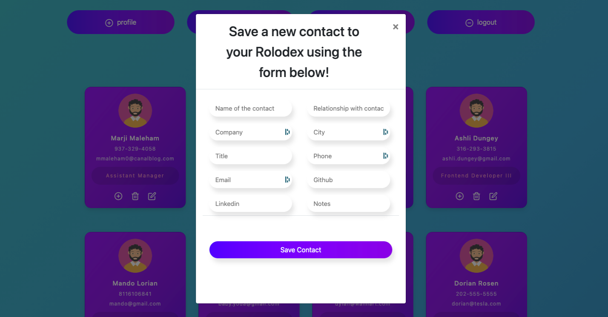

# **GitJobs**

---

## **Description**

Using GitJobs, you can track your professional contacts and job applications in one central place. Take control of your career today!

---

## **Table of Contents**

1. [Installation](#Installation)
2. [Technology](#Technology)
3. [Usage](#Usage)
4. [License](#License)
5. [Contributions](#Contributions)
6. [Tests](#Tests)
7. [Challenges](#Challenges)
8. [Future Dev](#Future-Dev)
9. [Screenshots](#Screenshots)
10. [Authors](#Authors)

---

## **Installation**

1. Clone the repo: `git clone https://github.com/jallan07/gitjobs-application-tracker.git`
2. Install NPM packages: `npm i`

   ***

---

## **Technology**

**Languages & Databases**:

- HTML
- CSS
- JavaScript
- MySQL

**Libraries & Frameworks**:

- Node.js
- Express.js
- jQuery
- Bootstrap
- Animate On Scroll

**Additional Packages**:

- Sequelize
- Handlebars.js
- JawsDB
- Heroku
- Passport (LinkedIn Oauth 2 Strategy)
- Travis.yml
- ESLint
- Nodemon
- .env
- Body-parser

---

## **Usage**

n/a

---

## **License**

Distributed under the MIT License.

---

## **Contributions**

**Current Contributors:**

_Josh Allan, Mark Cross, Andrew McGhie, Baxter Cox_

Contributions are what make the open source community such an amazing place to be learn, inspire, and create. Any contributions you make are greatly appreciated.

1. Fork the Project
2. Create your Feature Branch (git checkout -b feature/AmazingFeature)
3. Commit your Changes (git commit -m 'Add some AmazingFeature')
4. Push to the Branch (git push origin feature/AmazingFeature)
5. Open a Pull Request

   ***

## **Tests**

This application has been tested in a countless number of different environments to ensure peak performance. However, bugs may exist, especially when used in combination with additional packages. Please be sure to test the application after an initial download.

To test run the code after installing on your local device, use the following code:
`n/a`

---

## **Challenges**

**User OAuth**

- We found a pretty simple way to integrate LinkedIn user authentication via the Passport npm package. When we saw how simple it was to enable that, we decided to try adding Github authentication too. However, that proved to be more challenging. The documentation was a bit more unclear, and the Passport strategy required more legwork than we expected; so unfortunately, we had to ditch Github OAuth.
- Also relating to user authentication is the data that is passed once they are authenticated via Linkedin. With our current Linkedin OAuth integration, the only data that is received back in the user object is the user’s name, profile picture, and email address. Initially we had hopes to display the full user linkedin profile (headline, location, job experience, etc), but due to time constraints, we had to simplify the profile page to a simple card for our initial launch.

**Search Functionality**

- Another feature that we wanted to include but had to cut (mainly due to time constraints) was a powerful search feature that would allow the user to search for a company, a job, or a contact from anywhere within the app to see common threads. The core functionality was built out and working; but unfortunately, Handlebars wasn’t rendering the stylesheet properly on the search results pages. But given another few days, we would’ve been able to resolve all conflicts and had a working search feature.

**Company Foreign Key**

- Upon initial buildout of GitJobs, we had big plans to tie contacts and applications to a foreign key that lived on a separate Company table. That would make it easier to find matches between contacts and applications for the same company. However, we ran into some issues that we weren’t able to fix before the deadline, so now we’re investing how to create a company from the “add a contact/application” forms.

---

## **Future Dev**

Moving forward with GitJobs, we’d break future development out into 3 phases: Integrations, Intelligence, and Interaction. Why? Because integrations drive user intelligence, and intelligence helps users interact more efficiently. So let’s break it down a bit:

**Integrations**

- Implement a full Linkedin & Github OAuth strategy so that we collect more user data upfront, as soon as the user logs in.
- Expand the dynamic user profile to include full user details returned from LinkedIn and Github — that means location data, work experience, and repository information, etc.
- And lastly in the integrations phase, we would complete the setup of Twilio, which will come into play later in the interaction phase.

**Intelligence**

- Display full contact & application cards to provide further insights to the user
- Implement the site-wide search, and expand its functionality to include more fields and data objects
- Match job applications with contacts who work at the same company so that users know where they have a potential referral
- Again, all of this is to provide the user with more and more intelligence so they can make better informed decisions

**Interaction**

- Create the functionality that will allow users to check in with contacts and follow up with hiring managers via personalized text and email messaging (via Twilio’s messaging platform).

---

## **Authors**

Below is contact information for the authors of this application. Please feel free to reach out directly if additional questions exist.

- Name: Josh Allan
- Email: allan.josh07@gmail.com
- LinkedIn: https://www.linkedin.com/in/joshuamallan

---

- Name: Mark Cross
- Email: markdcross@gmail.com
- LinkedIn: https://www.linkedin.com/in/markdcross/

---

- Name: Baxter Cox
- Email: baxtercox@yahoo.com
- LinkedIn: https://www.linkedin.com/in/baxter-cox-05a81814a/

---

- Name: Andrew McGhie
- Email: andrewcmcghie@gmail.com
- LinkedIn: https://www.linkedin.com/in/andrewmcghie212/

---

## **Screenshots**

---

### Thank you for using GitJobs!
